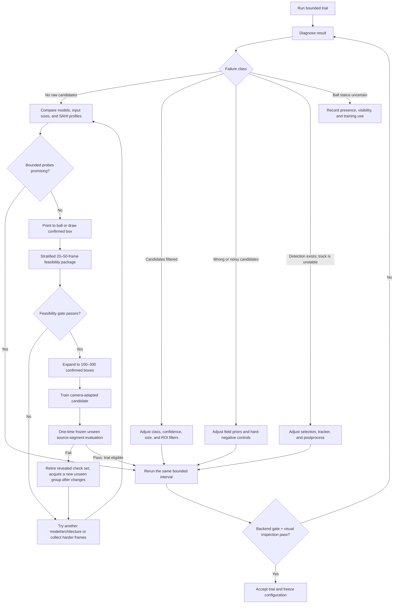

# Step 3 Tiny-Ball Detection, Tuning, and Camera-Adaptation Plan

**Status:** Execution active · PR-T3 open · CI and remote review active

**Date:** 2026-07-17

**Product area:** Production workspace · Step 3 of 5 · Trial and tuning

**Related completed plan:** `docs/superpowers/plans/2026-07-14-production-workflow-final-managed-pr-plan.md`

## 0. Managed Execution Status

- Program status: active
- Delivery order: `PR-T1 → PR-T2 → PR-T3 → PR-T4 → PR-T5`
- Current PR: PR-T3 · Point/Box Annotation and 20–50-Frame Feasibility
- Current branch: `codex/tiny-ball-annotation-feasibility`
- Current phase: PR-T1 and PR-T2 merged and cleaned up · PR-T3 is open as GitHub PR #114 · specification review is COMPLIANT · frontend, backend security, and final whole-diff reviews are APPROVE · official local gates are green · the honest real-video result remains sealed as `insufficient_evidence` with every downstream authorization false · CI and the mandatory remote-feedback window are active
- Managed workflow authorized: 2026-07-17
- Heartbeat: active · `tiny-ball-step3-managed-pr-heartbeat` · every 15 minutes
- Merge rule: implementation, specification review, quality review, local/CI checks, then a complete 10-minute remote-feedback window; any material corrective push restarts that window
- Latest independent checkpoint: durable child claim/crash recovery, exact child-plan replay, actual-side-effect retry floor, blocked-code equality, and the complete public lifecycle matrix independently pass 3 focused tests with 9 subtests plus 5 API tests with 60 subtests; this batch's P1 findings are closed pending the overall backend freeze.
- Latest resource/security checkpoint: six exact attacks pass; resource/no-store passes 29 tests with 20 subtests; full proxy/API/service passes 38 tests with 106 subtests; Ruff check and format pass all five scoped files. One opened source pass produces the retained ffmpeg snapshot handle, all queues/logs/processes/deadlines are bounded, and public/worker failures use fixed allowlisted codes and safe messages. The independent reviewer reports no scoped P0/P1/P2.
- Latest candidate-authority checkpoint: independent final review is APPROVE/CLOSED with P0=0, P1=0, and P2=0. Five modules pass 132 tests plus 132 subtests with zero failures, errors, or skips; Ruff lint and format pass all nine scoped files. Direct and repaired-CHECK positives pass both low-level and schema validation, while candidate omission/invention, origin/media/suggestion role confusion, authority missing/duplicate/order/current downgrade, four profile-metadata forgeries, copied request authority, and the complete locked/control plus six-to-zero candidate/revision/evidence/eligibility/request/manifest/attempt/package reseal are rejected. A detached structurally self-consistent package remains non-authoritative and is rejected by the trusted finalized-session package pointer before dataset expansion.
- Latest final-result resource checkpoint: independent review is APPROVE/CLOSED with P0=0, P1=0, and P2=0. Two focused tests with 21 subtests and 16 broader final-result tests with 31 subtests pass; Ruff lint and format pass. The reader accepts 1/70 frame media and 0/20 propagation reports, rejects non-canonical identities and 0/71 or 21 with typed status-409 `invalid_final_result`, and proves oversized manifests perform only the manifest read before rejecting—no exact-tree traversal or package/report/media read occurs.
- Latest frontend decode checkpoint: independent review is APPROVE/CLOSED with P0=0, P1=0, and P2=0. Three focused files pass 73/73 tests, both application/test TypeScript configurations pass, and scoped Prettier passes. Verified bytes are bound to exact session/frame/source SHA, the browser image must decode before any canvas/form/suggestion/propagation/finalization mutation is enabled, bilingual failures are accessible, and enabled-to-disabled in-flight point/box/resize/wheel/stage-pan terminal events produce zero geometry or viewport mutation.
- Latest crash-recovery checkpoint: independent final review is APPROVE/CLOSED with P0=0, P1=0, and P2=0. Fresh runs pass 20/20 focused crash tests and 85/85 joint annotation/review-proxy/API/real atomic-rename tests. Direct-create and constructor-startup recovery both path-bind session records and re-derive exact blocked-parent, sole child, normalized request, creation, and attempt authority before any registry write. Path/body mismatch, coherent rename plus request/operator/session reseal, and attempt-family tamper return typed 409 with byte-identical trees/registry; a real-gateway crash after session persistence recovers exactly six revealed groups and replays idempotently. Ruff, format, and diff checks pass.
- Latest propagation-capacity checkpoint: independent review is APPROVE/CLOSED with P0=0, P1=0, and P2=0. Four new tests, 15 focused propagation tests with six subtests, and 76 full service/propagation tests with 100 subtests pass. Same-session queued/waiting/committing/ready reservations enforce 20 supplemental frames and 20 report-capable jobs after exact/semantic idempotency; commit/restart rechecks before session mutation, avoids double-counting the current job, and durably fails an over-limit job without publishing an over-limit session. A legitimate 20-supplemental boundary finalized with sealed reports. Ruff, format, and diff checks pass.
- Latest contract-generation checkpoint: backend OpenAPI export and `--check` pass. Orval plus the repository postprocessor ran three times from existing local dependencies without changing workspace, lockfile, or build approvals; all 562 generated files were byte-identical with aggregate fingerprint `df26e8319fe3fe4106c83a2ebd6680936f594f9c6a6c28fbb79b7ecbdfdcf9e2`. Focused OpenAPI/schema/review-proxy API tests pass 45 tests plus 123 subtests, and library TypeScript build passes.
- Latest review-proxy frontend checkpoint: independent review is APPROVE/CLOSED with P0=0, P1=0, and P2=0. Three files pass 171/171 tests, both TypeScript configurations pass, and six scoped files pass Prettier. Strict parsing matches the frozen seven-status/six-stage contract and exact attempt root/number/direct-parent, request/execution/resource/result URL bindings. Create→failed→POST `{}` retry→new pointer→ready→replacement and refresh recovery pass; transport reload remains GET-only, retry is exposed only when `canRetry`, and stale/cross-attempt responses fail closed with typed API errors.
- Latest real-video gate: sealed development session `annotation-86e4908c1e91588a-4a91cc571805` produced four localizable positives and two unknown/unresolvable frames and may seed future expansion only as non-training development evidence. Frozen disjoint check session `annotation-91e658c38a2b1796-7ad7b9ba3fcb` finalized all 20 frames and 14 detector suggestions with package SHA `530b732d228b37b1e592ce2ef8b652dad125126185fa113ca9d5ec6b1265bbad`, report SHA `c359a269c6e7df15940d82875c8b8fab5f9d71ed1b182371df4ae8b00ab74f8e`, and result-manifest SHA `367a2bc8e63779ebf7c376ea06cb107a442c47c0f272e6136d4ebf4bdf081d22`. Five positives were metric-eligible; Top-1/Top-5 recall was 3/5, support and interval gates failed, status is `insufficient_evidence`, and every expansion/trial/qualification/production/full-run authorization is false. The sealed evidence and independent audit are recorded in `docs/operations/ball-annotation-real-video-evidence.md`.
- Latest integrated validation: the official backend route passes 2,263 tests with 71 skipped in 623.458 seconds, including OpenAPI `--check`; frontend Vitest passes 1,237/1,237 with 93.18% statements, 90.66% branches, 97.47% functions, and 94.24% lines; all library/application/test TypeScript checks pass; all production builds pass with the mockup sandbox's documented `PORT=3000` and `BASE_PATH=/`; and Chromium passes 44/44, including unseen-check isolation, Konva geometry, and accessibility. The changed T3 Python scope passes Ruff check/format, py_compile, and diff checks. Repository-wide Ruff remains non-clean only in untouched legacy baseline files (10 import-order findings and 96 files requiring historical formatting), which this surgical PR does not rewrite.
- Latest cross-process and Windows hardening checkpoint: native registry/execution/job/owner leases have stable identity guards, continuous owner/execution/job lifetime fencing, monotonic record-generation CAS, atomic guarded publish/delete, bounded stale-owner cleanup, and exactly-once crash recovery. Windows quarantine deletion is pinned before every mutation with parent/root/recursive no-share-delete handles; both pre-pin replacement and post-pin rename attacks preserve external trees. The strict review-proxy discovery set passes 132 tests with one Windows symlink-permission skip under `-X dev -W error::ResourceWarning`, with no dispatcher traceback or leaked handle. An import probe proves `api.app` creates no service/thread/lease before ASGI lifespan startup; shutdown closes and removes the service. Independent backend security and final whole-diff reviews are APPROVE with P0=0, P1=0, and P2=0.
- Blockers: no PR-T3 engineering blocker and no user action is required. The real-video result is intentionally not a PR-T3 failure: this PR's contract correctly produced and preserved an `insufficient_evidence` decision. It remains a fail-closed program gate for PR-T4, which must not start training or 100–300-box expansion until a new frozen unseen check satisfies support/interval rules and explicitly authorizes expansion.

| PR | Branch | Status | Pull request | Remote feedback | Merge |
| --- | --- | --- | --- | --- | --- |
| PR-T1 | `codex/tiny-ball-trial-diagnosis` | completed · Copilot corrections resolved · spec APPROVE · quality/security APPROVE · replacement CI passed | https://github.com/ferryhe/football_tracking/pull/112 | complete 2026-07-18T02:12:00Z–2026-07-18T02:22:27Z | `6a9db0e` · 2026-07-18T02:23:04Z |
| PR-T2 | `codex/tiny-ball-detector-registry-probes` | completed · replacement Node/Python CI passed · spec COMPLIANT · quality/security APPROVE · branches cleaned | https://github.com/ferryhe/football_tracking/pull/113 | complete 2026-07-18T13:28:50.4578869Z–13:39:00.559Z | `0ba5a802` · 2026-07-18T13:39:51Z |
| PR-T3 | `codex/tiny-ball-annotation-feasibility` | open · local gates passed · spec COMPLIANT · frontend/backend/final quality APPROVE · CI/feedback pending | https://github.com/ferryhe/football_tracking/pull/114 | active from 2026-07-19T15:51:00Z | pending |
| PR-T4 | pending | not started | pending | not started | pending |
| PR-T5 | pending | not started | pending | not started | pending |

## 1. Executive Decision

Step 3 must become a recovery and qualification workspace, not an “accept this trial” screen.

For a trial with no usable ball trajectory, the operator must be able to:

1. See whether the detector produced no candidates, candidates were filtered out, or tracking failed after detection.
2. Compare several bounded detector/model profiles on the same representative frames.
3. Adjust safe detector, slicing, filtering, selection, and tracking parameters according to the diagnosed failure class.
4. Point to the ball or draw a confirmed ball box when automatic detection fails.
5. Run a stratified 20–50-frame feasibility check covering near, medium, far, and applicable lighting conditions.
6. If local detection or propagation is promising, expand to approximately 100–300 human-confirmed boxes and train a detector adapted to the camera.
7. Evaluate the detector on a frozen, previously unseen temporal group before it becomes eligible for another bounded trial; qualification for the camera requires a later unseen match from that same camera.
8. Accept and freeze a trial only after explicit quality gates and human visual inspection pass.

The system must fail closed. A trial with zero raw candidates, zero tracklets, or all frames lost is `retune_required`; it must never be described as stable or expose “Accept this trial” as the primary action.

This is a new follow-up program. It does not reopen or rewrite the eight already-completed Production Workflow PRs, and it does not weaken the separate operational release gates in the completed managed plan.

### 1.1 Governance relationship to the completed plan

The completed plan recorded detector redesign and an in-app training platform as non-goals for its eight-PR program. Approval of this final follow-up plan creates a new additive scope; it does not retroactively change that historical scope. The new detector-development artifacts must remain separate from PR4A candidate-classifier evidence and PR4B target-audit truth. Only proven infrastructure primitives may be reused.

The two ML problems are different:

- This plan trains a **ball detector** from source-frame locations and boxes so that a ball candidate can be found.
- PR4A trains/qualifies a **candidate classifier and selective policy** over already-existing detector candidates so that match-ball/noise review can be provisioned.

A development box, point, propagated suggestion, or detector evaluation result from this plan is never automatically a PR4A/PR4B label, audit vote, qualified bundle, or production truth.

## 2. Observed Failure and Why a Repair Is Needed First

### 2.1 Reproduced source and trial

- Source: `python_backend/data/BXZFAuu1GQo_20260629_YRSL_U13B_LSSC_vs_DSC_PANO_5120x1440_hevc.mp4`
- Trial: `production_trial_270258b4-031f-4629-b084-ab4663ca6e49`
- Configuration: `python_backend/config/generated/stable_direct1920_conf20_full_20260621_131921_field_setup_production_trial_270258b4-031f-4629-b084-ab4663ca6e49.yaml`
- Output: `python_backend/outputs/runs/bxzfauu1gqo_20260629_yrsl_u13b_lssc_vs_dsc_pano_/production_trial_270258b4-031f-4629-b084-ab4663ca6e49`

The current evidence reports:

- 300 lost frames.
- 0 detected frames.
- 0 predicted frames.
- 0 raw candidate frames.
- 0 raw candidates in total.
- A misleading `stable` quality-gate result.

The local file named `python_backend/weights/football_ball_yolo.pt` identifies itself as a stock 80-class COCO YOLOv8n model with the generic `sports ball` class; it is not a football-specific detector. Direct probes at low confidence and large input size produced no sports-ball detections on six representative frames. A representative SAHI tiled probe also produced no candidate.

### 2.2 Immediate product defect

The current quality calculation evaluates gaps between existing tracklets. When no tracklet exists, there is no inter-tracklet gap to count, so the empty result can appear stable. Artifact readability and video playback are also currently treated as evidence readiness even when the tracking result is unusable.

The current Step 3 form exposes the base configuration, start frame, maximum frame count, postprocess, and follow-cam choices, but it does not expose the detector/model, SAHI, filter, selection, or tracker values carried by the tuning patch. Consequently an operator who sees an all-lost result has no meaningful recovery control other than rerunning or accepting it.

Therefore the first implementation must repair the fail-closed decision before adding model or training features:

- When metrics coverage is complete, `raw_candidates_total == 0` → `retune_required`.
- When metrics coverage is complete, `tracklet_count == 0` → `retune_required`.
- When `evaluated_frames > 0`, `lost_frames == evaluated_frames` → `retune_required`.
- Missing legacy counters, `evaluated_frames == 0`, decoder failure, and incomplete metrics → `insufficient_evidence`, never an inferred zero.
- A readable evidence video means only `evidence_available`; it never means `quality_acceptable`.
- “Accept this trial” is hidden or disabled until the backend quality gate and operator inspection are both satisfied.

These rules belong to a versioned `trial_signal_gate_v2` with stable reason codes and explicit `coverage_complete`; implementation must not silently reinterpret the existing full-run `quality_gate.status` field or break legacy consumers.

## 3. Goals and Non-Goals

### 3.1 Goals

- Recover from all-lost and materially incomplete trials without leaving Step 3.
- Offer multiple explicitly identified model candidates and parameter profiles.
- Preserve raw detector evidence so the operator can see what failed.
- Support source-pixel point and bounding-box annotations on real frames.
- Turn 20–50 frames into a reproducible feasibility decision, not an informal eyeball test.
- Turn 100–300 confirmed boxes into a reproducible camera-adapted development package and source-segment evaluation; reserve camera qualification for an unseen same-camera match.
- Keep every model, parameter, annotation, dataset, trial, and qualification result hash-bound and traceable.
- Keep the workflow usable by one operator while never claiming that the same person constitutes an independent production audit.

### 3.2 Non-goals

- No claim that one public model will work on every panoramic camera.
- No fabricated coordinate when the ball is not visible.
- No automatic promotion from a good-looking training score.
- No use of target qualification labels for training, threshold selection, or adaptive tuning.
- No silent upload of frames or video to a third-party service.
- No replacement of the existing full-production review/evidence contract.
- No global “football detector approved” claim from one camera’s qualification.
- No `production_approved` model state from Step 3; production approval is a run/release decision governed by the existing operational gates.

## 4. User Workflow Inside Step 3



Step 3 remains one of the five major production stages. These are subpanels revealed as needed, not additional top-level pages.

Any check set becomes revealed after its first scored evaluation. If the result influences model, threshold, tile, filter, or tracker changes, that set is permanently retired from qualification use and may only remain development evidence. A later claim requires a newly frozen, unseen temporal group; a camera-level claim requires a previously unseen match/session from the same camera profile.

## 5. Candidate Model Strategy

There are public football-specific candidates, but their published metrics do not prove performance on this 5120×1440 panoramic camera. Every candidate must pass the same local, source-bound probe and qualification process.

### 5.1 Candidate tiers

| Tier | Candidate | Purpose | Initial status | Important constraint |
| --- | --- | --- | --- | --- |
| Baseline | Current local stock COCO YOLOv8n, `sports ball` class | Reproduce the present behavior and provide a comparison floor | Baseline only | Generic COCO model; current real-video probe produced zero candidates |
| Free official baseline | Ultralytics YOLO11n and YOLO11s COCO weights | No-account local comparison; YOLO11n is the speed profile and YOLO11s is the initial quality profile | Required registry candidates | Free under the applicable Ultralytics license, but still generic COCO `sports ball` models rather than football-camera-specific weights |
| Public football candidate A | Roboflow `soccer-ball-detection-s2sg3/3`, YOLOv11n, one `ball` class | Fast football-specific feasibility probe | Unverified | Public project reports good aggregate metrics, but the exact model access method and our-camera performance must be verified |
| Public football candidate B | An explicit YOLO version from Roboflow `football-players-detection-3zvbc` | Compare a multi-class football-scene model | Unverified | The project contains several architecture/version families; the registry must bind an exact version rather than using “latest” |
| Local fine-tune A | YOLO11s and, if hardware permits, YOLO11m | Practical local camera adaptation from public plus camera labels | Proposed | Dataset and runtime/model licensing must be reviewed separately |
| Local fine-tune B | YOLO26 P2 small-object architecture | Evaluate a higher-resolution detection head for tiny objects | Proposed experiment | Ultralytics provides the P2 architecture definition, not a ready P2 pretrained weight; it requires training/fine-tuning |
| Comparator | A non-YOLO football/ball detector such as an explicit RF-DETR or Roboflow 3.0 project version | Determine whether the failure is specific to the YOLO family | Optional | Must remain clearly labeled as non-YOLO and follow the same egress/license rules |

Recommended initial selectable profiles are:

1. `current-coco-yolov8n-direct` — diagnostic baseline only.
2. `official-coco-yolo11n-direct` — free, local speed comparison.
3. `official-coco-yolo11n-sahi` — the same free weight with tiled inference.
4. `official-coco-yolo11s-direct` — free, local quality comparison.
5. `official-coco-yolo11s-sahi` — the initial recommended free quality profile for the panoramic tiny-ball probe.
6. `public-soccer-ball-yolo11n-direct` — football-specific direct inference, only after acquisition validation.
7. `public-soccer-ball-yolo11n-sahi` — the same exact acquired model with tiled inference.
8. `local-camera-yolo11s-sahi` — available only after source-segment evaluation makes it trial-eligible.
9. `local-camera-yolo26-p2` — experimental until trained and evaluated; it cannot inherit another model’s status.

The UI may show friendly names, but every run must persist the exact immutable model descriptor and profile digest.

### 5.2 Model registry contract

Each selectable model needs a `DetectorModelDescriptor` containing at least:

- Stable model ID and immutable version.
- Display name and architecture family.
- Local path or approved inference endpoint; never an unbound “latest” URL.
- SHA-256 for local weights and manifest.
- Source project/version and acquisition method.
- Class names and explicit mapping to `ball`.
- Expected input size, device, precision, and memory envelope.
- Dataset license metadata and model/runtime license metadata as separate fields.
- Whether frames leave the local machine, the destination, and operator consent state.
- Lifecycle state: `unverified`, `feasibility_passed`, `development_candidate`, `source_segment_qualified`, `camera_qualified`, or `retired`.
- Bound source, temporal-group, camera-profile, evaluation-package, threshold-profile, code-commit, and environment digests when applicable.

Local-first is the default. A third-party API candidate is evaluation-only unless external frame transfer is explicitly approved. Public availability of a dataset page does not guarantee that raw `.pt` weights can be downloaded without an account, plan, or inference runtime.

`source_segment_qualified` means that the frozen model/profile passed a one-time unseen temporal group from the same source and may be selected for another bounded trial. `camera_qualified` additionally requires a predeclared evaluation on at least one previously unseen match/session from the same camera profile. Neither state means production approval.

The camera profile binds all available camera/lens identity, native resolution, panoramic layout and crop, encoding, frame rate, field calibration class, and allowed operating conditions. Every evaluation additionally binds source SHA-256, match/session identity, temporal group, capture date/time and lighting tags. Unknown required identity fields narrow the claim; they may not be filled by inference.

### 5.3 Model-acquisition decision gate

Before PR-T2 commits to any external adapter, a time-bounded acquisition check must record:

- Exact project and version, architecture, class map, access method, immutable weight/runtime identity, and whether local execution is possible.
- Separate dataset, weight/model, runtime, and intended-deployment license findings.
- Account/plan requirements and whether frames would leave the machine.
- Weight SHA-256 or a stable hosted-model version and response contract.
- A smoke probe that proves the model can be loaded and returns interpretable raw candidates.

Only acquired and validated descriptors appear as selectable models. An inaccessible or legally incompatible public project remains an `unavailable` catalog finding, not a promised implementation deliverable. PR-T2 must provide the current YOLOv8n diagnostic baseline, the official free YOLO11n and YOLO11s weights, and the import/registry contract before it can claim model comparison is operational.

The initial free acquisition set is explicit: download and register official `yolo11n.pt` and `yolo11s.pt`, compute and persist their SHA-256 values, record the installed Ultralytics/runtime versions and license metadata, and smoke-test both direct and SAHI loading. No Roboflow account is required for this initial set.

### 5.4 Public-source findings

- Ultralytics documents SAHI as tiled inference for high-resolution images and small objects: <https://docs.ultralytics.com/guides/sahi-tiled-inference/>.
- Ultralytics publishes official YOLO11 n/s/m/l/x detection weights and loading instructions: <https://docs.ultralytics.com/models/yolo11/>. The initial free files are <https://github.com/ultralytics/assets/releases/download/v8.4.0/yolo11n.pt> and <https://github.com/ultralytics/assets/releases/download/v8.4.0/yolo11s.pt>.
- Ultralytics lists YOLO26 n/s/m/l/x variants and P2/P6 architecture YAMLs; P2/P6 pretrained weights are not supplied: <https://docs.ultralytics.com/models/yolo26/>.
- Ultralytics publishes AGPL-3.0 and Enterprise licensing routes; commercial/private deployment needs an explicit license review: <https://www.ultralytics.com/license>.
- The Roboflow one-class football candidate is published at <https://universe.roboflow.com/soccerdata-cnauk/soccer-ball-detection-s2sg3>.
- The multi-class football project is published at <https://universe.roboflow.com/roboflow-jvuqo/football-players-detection-3zvbc>.
- Roboflow documents public model discovery, dataset download, and its model-weight/inference access paths at <https://docs.roboflow.com/universe/find-a-model-on-universe>, <https://docs.roboflow.com/universe/download-a-universe-dataset>, and <https://docs.roboflow.com/deploy/download-roboflow-model-weights>.
- SoccerTrack v2 supplies domain-matched panoramic 4K match footage under CC BY 4.0, including day and night conditions, but it is not a positive ball-box dataset; it is useful for background, negative, and robustness evaluation: <https://atomscott.github.io/SoccerTrack-v2/>.

Published project metrics are discovery signals only. They must be displayed as publisher-reported values and never as our qualification result.

## 6. Failure Classification and Situation-Specific Controls

The backend must classify a trial before the frontend recommends a recovery action.

| Failure class | Observable evidence | Backend controls | Frontend action |
| --- | --- | --- | --- |
| `no_raw_candidates` | Raw candidate count is zero | Model ID/version, `imgsz`, device, precision, detector confidence, direct/SAHI mode, tile size, overlap, merge threshold, frame sampling | “Compare detector profiles”; show identical frames with raw overlays; do not recommend tracker tuning |
| `all_candidates_filtered` | Raw candidates exist but accepted detector candidates are zero | Allowed class map, minimum confidence, minimum/maximum box size, aspect ratio, field/ROI inclusion, edge exclusion | “Adjust detector filters”; show rejected boxes with rejection reasons |
| `wrong_or_noisy_candidates` | Candidates exist but are dominated by lines, heads, shoes, shadows, or spare balls | Model/profile, confidence, size prior, positive field ROI, negative ROI, temporal consistency, hard-negative profile | “Reduce false candidates”; side-by-side raw and selected overlays |
| `unstable_tracking` | Selected detections exist but IDs/gaps/jumps are poor | Candidate scorer weights, maximum displacement, Kalman/optical-flow parameters, gap filling, smoothing, postprocess | “Tune tracking”; preserve detector settings while comparing trajectory metrics |
| `temporarily_unlocalizable` | The ball may be present but is occluded, blurred, or below source resolution | Short-window local re-detection, bounded propagation, occlusion state, maximum prediction gap | “Record unknown/unresolvable”; no synthetic coordinate and no negative training label |
| `confirmed_absent` | A human can establish that the match ball is outside the image or absent from the sampled scene | Explicit presence/background record | “Mark absent”; eligible as background only after confirmation |
| `metrics_unavailable` | Legacy counters were not collected or report coverage is incomplete | Evidence regeneration/versioned metrics collection | “Regenerate diagnosis”; do not infer zero and do not allow acceptance |
| `decode_integrity_failed` | Frame decode failed, produced gray/low-information media, or ended early | Sequential/preroll decode, verified review proxy, integrity report | “Repair review source”; do not annotate, score, or accept affected media |
| `all_models_failed` | Bounded probes across approved profiles remain below feasibility | Annotation package and training-job creation | “Start 20–50-frame feasibility check” |

Every control change creates a new tuning-patch version. The operator can compare it with the previous trial and revert it; it never mutates an accepted trial or a frozen configuration.

Presence, visibility, and training use are orthogonal annotation fields:

- `presence = present | absent | unknown`
- `visibility = visible | partial | unresolvable | not_applicable`
- `training_use = positive | background | excluded`

Only a confirmed, localizable `present` item with a human-confirmed box may be a positive detector label. Only human-confirmed `absent` may be background. `unknown`, unlocalizable occlusion, severe blur, and source-unresolvable frames are excluded from detector loss and recall/false-positive denominators; they remain coverage and failure evidence.

The diagnostic artifact must expose monotonically reconciled stage counters—raw model outputs, class-mapped candidates, filter survivors, selector choices, tracklets, predicted frames, and lost frames—plus per-candidate rejection reasons. A mismatch or incomplete stage is `insufficient_evidence`, not a favorable zero.

## 7. Frontend Design for Step 3

### 7.1 Step 3 recovery choices

After diagnosis, Step 3 presents three recovery options inside the same stage. They are actions/subpanels, not new top-level workflow stages:

1. **Tune parameters and rerun** — the normal first option when detector signal exists or a bounded parameter/model profile may recover it.
2. **Compare model profiles** — use the current YOLOv8n baseline and the free official YOLO11n/YOLO11s direct/SAHI profiles on the same exploratory frames.
3. **Point/box the ball and build an adapted model** — use when bounded free-model and parameter probes remain inadequate.

The backend diagnosis recommends one option, but the operator may inspect or choose any safe applicable option. None of these actions permits acceptance until the versioned trial gate and visual inspection pass.

“Tune parameters and rerun” must be a complete, visible workflow rather than a raw JSON editor. It exposes bounded, explained controls for:

- Detector confidence and inference image size.
- Direct versus SAHI mode, tile size, overlap, and merge threshold.
- Allowed labels, candidate size/aspect limits, field ROI, and exclusion zones.
- Candidate-selection thresholds/weights and continuity priors.
- Tracking displacement, prediction-gap, smoothing, and postprocess controls.

The UI shows the previous value, proposed value, safe range, effect/risk explanation, estimated runtime, reset-to-profile action, and exact tuning-patch diff. Saving creates a new immutable patch version; rerun creates a new trial and never changes the prior attempt.

### 7.2 Panel sequence

1. **Trial result and diagnosis**
   - Playable evidence video.
   - Large summary: raw/class-mapped/filtered/selected candidates, detected/predicted/lost ratios, tracklets, suspicious tracklets, longest lost streak, false-positive islands, maximum step/jumps, trigger/event counts, follow-cam jerk/snaps, evidence coverage, and quality state.
   - Plain-language diagnosis and recommended next action.
   - Wide-context sheets, tight crops, and synchronized follow-cam evidence; media-integrity failure blocks visual acceptance.

2. **Model and probe comparison**
   - Select two or more approved profiles.
   - Select or accept an explicitly labeled exploratory frame set; a frozen check set is not browsable until the attempt is locked.
   - Run bounded probes only; no full-video job.
   - Compare source image, raw boxes, selected box, latency, candidate count, and rejection reasons.
   - Show candidates per frame and the fixed top-k cap so high recall cannot be bought with unlimited suggestions.

3. **Adjustment controls**
   - Quick presets based on the failure class.
   - Advanced drawer for exact detector, SAHI, filter, selection, tracker, and postprocess values.
   - Estimated runtime/memory warning before a large-input or heavily tiled probe.

4. **Point/box annotation workspace**
   - React Konva source-frame canvas with zoom and pan.
   - Click center point, draw/resize confirmed box, delete, undo, and keyboard navigation.
   - Record presence, visibility, and training use separately; incompatible combinations are rejected.
   - Display source-pixel coordinates, source frame index, presentation timestamp, and decode/proxy binding.
   - Optional local box suggestion around a point; the human must confirm it.
   - Optional short-window propagation; every propagated item remains `suggested` until confirmed.

5. **20–50-frame feasibility dashboard**
   - Coverage by near/medium/far scale, lighting, motion/occlusion, confirmed background, and excluded/unresolvable frames.
   - Progress, missing strata, unconfirmed suggestions, frozen attempt identity, and development/check group separation.
   - Feasibility result and next recommendation.

6. **100–300-box training and evaluation dashboard**
   - Active-learning queue, labeling progress, split/lineage summary, training status, one-time evaluation metrics with intervals, failure examples, and lifecycle state.

7. **Rerun comparison and acceptance**
   - Previous vs current model/profile/config digest.
   - Detection/trajectory metrics and synchronized visual comparison.
   - “Accept trial” appears only after all gates pass.

### 7.3 Required operator actions

- Adjust and rerun.
- Compare models.
- Point to ball.
- Draw/confirm ball box.
- Record present/absent/unknown, visibility, and training use.
- Start feasibility package.
- Expand confirmed dataset.
- Train candidate.
- Evaluate or reject candidate.
- Select a `source_segment_qualified` or stronger model for a new trial.

The screen must explain that one operator can create development annotations and make a local trial decision, but cannot label their own work as an independent production audit.

## 8. Backend Capabilities and Contracts

### 8.1 Proposed API groups

Routes follow the existing versioned `/api/v1` and generated-client conventions. Capability boundaries remain separate:

- `GET /api/v1/detector-models` — list descriptors and lifecycle states.
- `POST /api/v1/detector-models/import` — import a trusted local descriptor/weights package with path containment and digest validation.
- `POST /api/v1/detector-probes` — return `202 Accepted` for a bounded multi-profile probe.
- `GET /api/v1/detector-probes/{job_id}` and `POST .../{job_id}/cancel` — authoritative status/evidence and bounded cancellation.
- `POST /api/v1/ball-annotation-sessions` — freeze the source, decode contract, sampling plan, and data-group assignments; a check session must also bind the exact finalized development session/package that supplied its attempt-family authority.
- `GET /api/v1/ball-annotation-sessions/{session_id}/frames/{frame_index}` — serve the exact verified source-bound frame.
- `PUT /api/v1/ball-annotation-sessions/{session_id}/annotations/{frame_index}` — append a superseding point/box/presence record using revision/ETag concurrency.
- `POST /api/v1/ball-annotation-sessions/{session_id}/propagation-jobs`, plus GET/cancel — create advisory suggestions without confirming truth.
- `POST /api/v1/ball-annotation-sessions/{session_id}/finalize` — create an immutable package manifest.
- `POST /api/v1/detector-training-jobs`, plus GET/cancel — train from one eligible finalized development package.
- `POST /api/v1/detector-evaluation-jobs`, plus GET/cancel — evaluate one immutable candidate against one frozen unseen package.
- `POST /api/v1/detector-models/{model_id}/lifecycle-transitions` — apply only a server-validated transition supported by an immutable evaluation report.

Every probe, propagation, training, and evaluation operation uses the existing child-run/job style:

- `POST` returns `202` with a content-derived idempotency key, frozen request digest, `job_id`, and canonical status URL.
- One active job exists per frozen intent/resource key; an identical request returns the same job, while a conflicting request fails closed.
- The authoritative state machine records `queued`, staged execution states, `committing`, `ready`, `failed`, `cancelled`, and `blocked`, along with progress, stage, error/blocker codes, and `retry_from_job_id`.
- A retry creates a new session/attempt with explicit lineage and preserves source, model/profile/control, sampling manifest/metric, parent trial, and all pre-reveal groups. A `review_proxy_required` retry may add only a verified source-bound proxy/decode upgrade; a pre-reveal worker/code failure may bind a new runtime/execution bundle, but neither case may overwrite the prior attempt or reuse an attempt after labels/results were exposed.
- A service-owned lease/heartbeat and single-writer lock support restart recovery and prevent two workers from publishing the same result.
- Cancellation is cooperative before commit; once atomic publication begins, cancellation is rejected and the terminal manifest decides the result.
- Staging output is same-volume, resource-limited, cleaned or quarantined after failure, and atomically published only after complete verification. Disk exhaustion, GPU OOM, worker death, and corrupt checkpoints publish no selectable model.

### 8.2 Core types

- `DetectorModelDescriptor`
- `DetectorProfile`
- `DetectorProbeRequest`
- `DetectorProbeReport`
- `TrialFailureClassification`
- `BallAnnotation`
- `AnnotationPackageManifest`
- `TrainingJob`
- `TrainingReport`
- `SourceSegmentEvaluationReport`
- `CameraQualificationReport`
- `SourceFrameBinding`
- `AsyncJobStatus`

A `BallAnnotation` must include source ID/signature, frame index, verified decoder timing observation, source width/height, source-pixel center, optional confirmed bounding box, presence, visibility, training use, scale stratum, lighting tag, annotation state (`suggested` or `confirmed`), operator, timestamps, revision, provenance, and the exact `SourceFrameBinding`. A true presentation timestamp is recorded only when the decoder exposes one through a separately verified contract; otherwise it is explicitly `not_collected`, while `frame_index/fps` remains display-only and is never labeled PTS. A finalized package has one effective superseding record per sampled frame and retains the append-only revision chain.

Every development package and linked check artifact also seals one `attempt_family_sha256`: a canonical identity over source/tracking identity, locked model/profile/weights, parent trial, exact development-probe report/result/execution/profile lineage, development sampling manifest/groups, and the sampling/metric profiles. It excludes the later check group/result to avoid a circular identity. Check creation supplies the finalized development session/package identity; the server re-reads it, requires `may_seed_dataset_expansion=true`, verifies the same attempt family, source, profile, and probe lineage, and echoes the binding through the check session, package, and report. A self-hashed package or schema-valid upload is structural evidence only: dataset expansion must re-read the trusted finalized session and require its detached `final_package.package_sha256` to equal the exact package, while the sealed session-request authority rebuilds the originally selected locked/control profiles from every immutable detector job.

### 8.3 Safety and reproducibility

- Contain every local path beneath configured trusted roots.
- Reject symlinks/reparse points and non-regular weight/dataset files according to existing platform-safe repository patterns.
- Do not accept arbitrary executable model code or an arbitrary URL as an import.
- Hash weights, data manifests, annotations, source signatures, configs, code commit, and environment.
- Make finalized packages and qualification reports immutable and append-only.
- Require explicit approval before any frame leaves the local machine.
- Record cancellation, partial failure, disk exhaustion, device out-of-memory, and corrupt-frame states without publishing a partial model.
- Preserve raw candidates and rejection reasons for reproducible diagnosis.

### 8.4 Existing evidence infrastructure: reuse without semantic mixing

The implementation should reuse proven mechanisms from `candidate_dataset`, `candidate_annotations`, PR4A, and PR4B where their semantics match:

- Source/group binding and temporal grouping.
- Sequential/preroll/direct decode verification and media-integrity checks.
- Immutable manifests, SHA-256 binding, atomic publication, input-change detection, path containment, and no-follow validation.
- Append-only revisions, deterministic seeds, job lifecycle, cancellation/retry, and leakage validation.

Detector-development artifacts use a new schema, artifact type, and trusted root such as `ball_detector_development_v1`. They cannot be imported as PR4A blind votes, candidate-classifier labels, selective-policy evidence, target finite-population audit truth, activated review queues, or corrections to an existing bundle. PR4B records with `training_eligible=false` remain ineligible here.

### 8.5 HEVC and exact-frame media contract

Annotation and evaluation may not depend on unverified random seeking. Reuse the repository’s existing decode modes and media-integrity behavior:

1. Prefer verified sequential decoding for a package; use verified preroll where bounded extraction is necessary.
2. Direct seek is accepted only when reported frame position, dimensions, frame information, and image-integrity checks pass.
3. If the HEVC source cannot provide stable review frames, create a hash-bound H.264/MP4V review proxy with an immutable source-to-proxy frame/PTS map.
4. Bind source SHA-256, proxy SHA-256, decoder/runtime fingerprint, requested and effective decode mode, frame index, raw decoder timing observation, true PTS only when independently available, actual decodable frame count, and integrity-report digest.
5. Gray/low-information frames, mapping mismatch, decoder shortfall, or corrupt terminal media fail closed and cannot become annotation or evaluation evidence.
6. Finalization re-reads and verifies every exact JPEG against its frozen digest and dimensions, then copies those bytes into the immutable final-result allowlist and manifest; publication and every later result read re-verify the sealed media, so a missing or replaced upstream probe artifact can neither become nor invalidate silently trusted evidence.

## 9. The 20–50-Frame Feasibility Protocol

This package is a one-time directional check of whether a locked detector/profile can localize the ball often enough to justify collecting 100–300 boxes. It is not a production training corpus, a camera qualification set, or a reusable tuning scoreboard.

### 9.1 Sampling

Model exploration and parameter tuning use separately labeled development frames. After the model, weight digest, input/tile profile, confidence/filter settings, candidate budget, matching rule, and metric thresholds are locked, select 20–50 previously unseen check frames by a frozen, source-bound sampling plan:

- Near, medium, and far apparent ball scale.
- Applicable bright sun, shadow, backlight, twilight, or artificial light.
- Ground, airborne, motion-blurred, partially occluded, and reappearance states where present.
- Confirmed-absent background frames; unknown/unresolvable frames are counted separately and excluded from score denominators.
- Temporal diversity: avoid filling the set with adjacent near-duplicate frames.
- At least 15 confirmed localizable positive frames and at least 5 confirmed-absent frames; otherwise the result is `insufficient_evidence`.
- At least 3 localizable positives in each applicable near/medium/far stratum and each major lighting stratum; missing support narrows the claim or makes it insufficient.

If a stratum does not exist in the source, mark it `not_applicable` with evidence; do not fabricate coverage.

The sampling manifest freezes group membership before check labels or results are shown. Adjacent frames, propagated labels, crops, tiles, transcoded/proxy frames, and alternate encodes of the same moment inherit the same source/temporal group and cannot cross a development/check boundary.

The frozen manifest also predeclares each check frame's lighting stratum. A later human lighting tag that contradicts that declaration is published as a raw mismatch and makes the attempt `insufficient_evidence`; it cannot be used post hoc to satisfy a quota. Correcting the declared lighting intervals or quotas requires a new unseen attempt.

### 9.2 Annotation semantics

- A center point can seed a local tracker or re-detection window.
- A human-confirmed bounding box is required for ordinary YOLO training and is preferred for feasibility scoring.
- The system may suggest a box or propagate a nearby frame, but only a human-confirmed box is ground truth. The operator can accept and adjust a suggestion or explicitly dismiss it and draw manually; both decisions are append-only and auditable, and finalization cannot leave a suggestion pending.
- Presence, visibility, and training use follow the orthogonal contract in Section 6; unknown/unresolvable frames never receive an invented point, box, positive, or background label.
- All coordinates use original source-frame pixels, not display-canvas pixels.

The versioned matching profile defines evaluation unambiguously:

- Raw candidates are class-mapped model outputs ranked by detector confidence before tracker selection.
- Top-1 and Top-5 inspect at most the first 1 or 5 candidates; no unlimited candidate list can increase recall.
- One candidate may match at most one confirmed ball and one confirmed ball may match at most one candidate.
- The initial `tiny_ball_feasibility_metric_v1` apparent-size profile is bound to source height `H`: far box diagonal is at most `H/80`, mid is above `H/80` and at most `H/40`, and near is above `H/40` and at most `0.075H`; plausible truth boxes have diagonal from 1 source pixel through `0.075H` and aspect ratio from 0.25 through 4. Human scale labels are checked against these derived bands. Values outside the profile or contradictory labels are published and make the attempt insufficient; they cannot increase recall or stratum support.
- The primary tiny-object localization rule uses a predeclared source-pixel center-distance/evaluation-region tolerance derived from the confirmed box and capped at `max(4, H/45)` source pixels: `min(max(4, 0.75 × box_diagonal), max(4, H/45))`. Exact IoU and center distance are also reported because IoU alone is unstable for a few-pixel ball.
- Unmatched candidates within the fixed candidate budget are false candidates; all raw numerator, denominator, candidate-budget, and per-stratum counts are published.

### 9.3 Initial adjustable feasibility targets

These are initial directional targets. The frozen metric profile must publish raw counts and one-sided 95% interval bounds using one predeclared method; thresholds can change only in a new attempt and never rewrite an old report:

- Every applicable scale and lighting stratum represented.
- Required positive/background and per-stratum support from Section 9.1 is satisfied.
- Top-5 localization recall point estimate at least 80% and Top-1 at least 60% on the one-time check package.
- The report shows one-sided 95% lower bounds for recall, the upper bound for false candidates per evaluable frame, and candidates per frame. Small support is visibly labeled exploratory even when point targets pass.
- Candidate volume stays within the predeclared maximum of five scored candidates per frame; raw candidates beyond that remain visible as diagnostic load.
- A seeded local propagation probe must state its confirmed-frame coverage, drift, and maximum safe propagation window.

`feasibility_passed` authorizes expansion to 100–300 confirmed positive boxes. It does not make a model trial-eligible, camera-qualified, production-approved, or eligible for a full production run.

After the check result is revealed, that package can never qualify a changed model/profile. If the gate fails, it is retired to development evidence. The system may recommend another public model, input/tile profile, small-object architecture, or more representative development frames, but the next check must use a newly frozen unseen temporal group. If no honest new group exists, the result remains infeasible/insufficient rather than recycling evidence.

## 10. The 100–300-Box Camera-Adaptation Protocol

### 10.1 Dataset expansion

- Collect approximately 100–300 human-confirmed, localizable positive boxes through active learning from uncertain, false-positive, and lost intervals. Confirmed-absent background frames are tracked separately and do not inflate the positive-box count.
- Include hard negatives such as white lines, shoes, heads, shadows, signage, and spare balls where present.
- Retain confirmed background and excluded unknown/unresolvable states without converting one into the other.
- Split train, validation, and evaluation by immutable source/temporal group; never randomly split adjacent frames, crops, proxies, encodes, tiles, or propagation families across sets.
- Use training/validation groups for model and threshold selection. Evaluation labels remain sealed until the exact attempt manifest is frozen.
- Freeze model weights, detector/profile parameters, thresholds, matching/metric profile, source groups, and evaluation sample before opening evaluation labels or results.
- Prevent any evaluation, qualification, PR4B target-audit, or target-application label from entering training, calibration, threshold selection, or repeated adaptive tuning.
- Once an evaluation is revealed, any subsequent change requires a new attempt and a new unseen group. The revealed set is permanently development-only for future models.

### 10.2 Training package

The immutable training manifest binds:

- Source and annotation-package digests.
- Exact train/validation/sealed-evaluation frame and group lists.
- Base model descriptor and weight digest.
- Training configuration, seed, augmentation policy, epochs, and early-stopping rule.
- Code commit, dependencies, hardware/environment, logs, checkpoints, and final weight digest.
- Dataset, base-model, and runtime licensing metadata.
- Data-group ancestry that proves every adjacent/derived/proxy item stayed in one split.

Train at least one practical baseline such as YOLO11s before increasing model size. Evaluate SAHI as an inference profile independently from model training. Evaluate YOLO26 P2 only after the basic pipeline is reproducible, because it is an architecture experiment rather than a ready public football weight.

### 10.3 Initial adjustable source-segment evaluation targets

The first 100–300-box cycle normally comes from one match. It may establish only `source_segment_qualified`, using a frozen unseen temporal group with at least 50 localizable positives, at least 50 confirmed-absent/evaluable background frames, at least 10 positives per applicable near/medium/far stratum, and at least 10 positives per applicable major lighting stratum. Insufficient support returns `insufficient_evidence` or a narrower declared scope.

The initial locked targets are:

- Top-5 candidate recall at least 90%.
- Top-1 candidate recall at least 75%.
- One-sided 95% recall lower bounds of at least 80% for Top-5 and 60% for Top-1.
- False candidates no more than 0.1 per evaluable frame by point estimate and by the predeclared one-sided 95% upper bound.
- No missing applicable near/medium/far or lighting stratum.
- Repeated evaluation from the same manifest and environment reproduces the published report.
- A new bounded end-to-end trial must pass the fail-closed detector/track quality gate and operator visual inspection.

These thresholds are initial product targets and may prove too strict for the available sample; the system must report measured insufficiency rather than weaken or post-select them. A model that passes is eligible only for bounded trials within its declared source/camera profile.

### 10.4 Camera qualification boundary

`camera_qualified` requires a new, previously unseen match/session captured by the same bound camera profile. Before labels are opened, freeze the model, all thresholds/profiles, match identity, sampling/groups, support floors, and metric method. Apply at least the same positive/background and per-stratum support floors as Section 10.3; any tuning after the result retires that match evaluation for the next claim.

If no independent same-camera match exists, the strongest honest state is `source_segment_qualified`. Camera qualification still does not produce `production_approved`; the full-run, PR4A/PR4B, exact-SHA, independent review, lineage, render, and release gates remain separate.

## 11. Quality Gates

### 11.1 Trial acceptance

Acceptance requires all of the following:

- `trial_signal_gate_v2.coverage_complete=true`; at least one raw candidate/tracklet and a non-all-lost result are necessary but never sufficient.
- The frozen threshold-profile digest passes raw and cleaned detected/predicted/lost ratios, longest lost streak, false-positive islands, tracklet and suspicious-tracklet counts, maximum step and large jumps, AI-trigger/event-candidate budgets, and follow-cam jerk/snaps/action retention.
- Metrics and visual samples are reported across applicable near/mid/far scale, lighting, and important attacking/transition windows rather than only as whole-trial averages.
- All required artifacts are readable, media-integrity checked, and bound to the current trial/model/profile/source/decoder identities.
- Wide-context sheets, tight crops, and playable follow-cam evidence show the marker near a visible/plausible ball path rather than field lines, body parts, spectators, or spare balls.
- No unresolved high-severity diagnosis remains.
- The operator explicitly confirms visual inspection.

Every numeric threshold and matching rule lives in a versioned profile. PR-T1 must establish conservative defaults or `insufficient_evidence`; the frontend cannot invent acceptance thresholds. A legacy/missing field is unknown, not zero and not pass.

### 11.2 Model lifecycle transition

Any transition to `feasibility_passed`, `source_segment_qualified`, or `camera_qualified` fails closed on:

- Missing/changed model digest.
- Missing class mapping or source license metadata.
- Qualification leakage or temporally overlapping splits.
- Incomplete strata or insufficient support.
- Failed threshold or non-reproducible report.
- External frame transfer without recorded approval.
- Model/runtime license incompatibility with the intended deployment.

### 11.3 Full-run boundary

Only a configuration frozen from an accepted bounded trial may start a full run. A camera-qualified model does not bypass the full-run review, exact-SHA evidence, independent audit, lineage, render, or release gates documented by the completed Production Workflow plan.

## 12. Proposed Multi-PR Delivery Plan

These are follow-up PRs and should use fresh branches from the latest clean `main`. Final PR numbering should be assigned only after approval so it does not collide with the completed PR1–PR6 ledger.

The dependency DAG is deliberately serial:

```text
PR-T1 → PR-T2 → PR-T3 → PR-T4 → PR-T5
```

Each branch starts only after its predecessor is merged and from that latest clean `main`. T1 owns the versioned diagnostic/metric contract; T2 consumes it for probes; T3 consumes T2 model/frame evidence; T4 consumes only a structurally eligible T3 finalized development package plus a separately linked, disjoint, same-source/profile T3 check result whose immutable status is `feasibility_passed`; T5 integrates the completed contracts. The check labels remain evaluation-only and never enter training. This avoids parallel edits to the same OpenAPI/generated client, Step 3 state, and artifact schemas. Each capability is feature-flagged and independently fail-closed so T1 can ship without enabling training.

### PR-T1 · Fail-Closed Trial Diagnosis and Recovery Actions

**Deliverables**

- Add `trial_signal_gate_v2` with coverage-complete, unknown/not-collected, decode-failure, zero-candidate, zero-tracklet, all-lost, and stable reason codes without reinterpreting the legacy full-run gate.
- Backend `TrialFailureClassification`, reconciled stage counters, versioned threshold profile, and stable reason codes.
- Step 3 diagnosis summary, disabled/hidden accept action, and “Adjust and rerun” path.
- A bounded, schema-driven tuning editor for detector, direct/SAHI, filtering, selection, tracking, and postprocess controls; it displays ranges/explanations/diffs and creates immutable tuning-patch versions rather than accepting arbitrary JSON.
- Raw/class-mapped/filtered/selected/tracklet counts, rejection reasons, real-video trajectory metrics, and wide/tight/follow-cam evidence status.
- Migration-safe behavior for old trials with incomplete metrics.

**Tests and gates**

- Python unit/property tests for unknown/not-collected, zero evaluated frames, decoder failure, empty, all-lost, partial, noisy, unstable, and acceptable trajectories.
- API contract and generated-client idempotence tests.
- Frontend unit/component tests for every diagnosis and action state.
- Browser regression proving the reproduced zero-result trial cannot be accepted.
- Existing Python, Node, accessibility, and build gates remain green.

### PR-T2 · Detector Model Registry and Bounded Probe Comparison

**Deliverables**

- Immutable model descriptors, profiles, import validation, and qualification states.
- Model-acquisition dossier; only accessible, license-reviewed, exact versions become selectable.
- Direct and SAHI bounded probe jobs using the 202/idempotency/status/cancel/recovery contract and resource limits.
- Exact-version model selector and side-by-side probe evidence.
- Required initial registry entries for the current YOLOv8n baseline plus official free YOLO11n and YOLO11s weights, each with direct and SAHI profiles, SHA-256/runtime/license metadata, and no unbound “latest”.
- Public football-specific adapters remain optional until their exact access and license checks pass; no promise of an inaccessible adapter.
- External-egress consent and licensing/access indicators.

**Tests and gates**

- Descriptor/digest/class-map validation and path-containment security tests.
- Direct/SAHI parity, merge, idempotency, restart recovery, cancellation/commit race, OOM, disk exhaustion, worker death, corrupt-frame, and partial-result tests.
- Fixture-model integration tests; network-dependent candidates are optional evaluation jobs, not required CI.
- UI comparison, failure, accessibility, and responsive-browser tests.
- Bounded real-video probe report attached to PR evidence.

### PR-T3 · Point/Box Annotation and 20–50-Frame Feasibility

**Deliverables**

- Source-bound annotation sessions and immutable finalized packages.
- Konva point, box, zoom/pan, visibility, undo/delete, and keyboard-accessible workflows.
- Advisory box suggestion and short-window propagation with mandatory confirmation.
- Orthogonal presence/visibility/training-use contract with invalid-combination rejection.
- Verified sequential/preroll frame extraction and hash-bound review-proxy mapping.
- Stratified sampler, sealed group assignment, coverage dashboard, and one-time frozen feasibility report.
- An explicit fail-closed T3→T4 handoff: check packages always have `training_eligible=false` and `may_seed_dataset_expansion=false`; a finalized development package remains non-training truth but may set `may_seed_dataset_expansion=true` only after all required frame roles, exact media, timing, coordinates, revisions, propagation lineage, and conflict checks pass, with machine-readable eligibility reasons. That flag means only “safe seed data,” not authorization: PR-T4 must additionally verify a separately linked immutable check report for the same source/profile/attempt family, disjoint temporal groups, `status=feasibility_passed`, and `authorizations.may_expand_to_100_300_boxes=true`; check labels never enter training.

**Tests and gates**

- Source/display coordinate round-trip, resize, zoom, and high-DPI tests.
- Annotation concurrency, superseding revision, digest, finalize/idempotency, and no-follow/path tests.
- HEVC gray/low-information frame, decoder-shortfall, proxy-map, PTS/index, and media-integrity tests.
- Sampling support, candidate-budget/matching metrics, interval calculation, group ancestry, revealed-set retirement, and temporal/derivative leakage tests.
- Component, accessibility, mobile, and end-to-end annotation tests.
- Manual visual verification on 20–50 frames from the reproduced source.

**Execution result (2026-07-19)**

- The complete PR-T3 implementation and local test matrix pass, including the official 2,263-test backend route, 1,237 frontend tests, TypeScript/build gates, 44 Chromium scenarios, strict no-resource-leak proxy regression, and independent specification/security/final-quality approval.
- The real source was annotated and sealed honestly: the 20-frame check produced five metric-eligible positives, Top-1/Top-5 recall of 3/5, insufficient support/interval bounds, and status `insufficient_evidence`.
- PR-T3 therefore demonstrates the required fail-closed contract and may proceed through review/merge. PR-T4 remains unauthorized until a new frozen unseen check returns `feasibility_passed` with `may_expand_to_100_300_boxes=true`; no check labels may enter training.

### PR-T4 · 100–300-Box Training and Source-Segment Evaluation

**Deliverables**

- Active-learning expansion queue.
- Reproducible local training jobs and immutable reports.
- Sealed temporal-group splits, leakage checks, attempt freezing, source-segment evaluation, and lifecycle-transition rules.
- YOLO11s baseline training path; optional larger/P2 experiments remain isolated profiles.
- Training/evaluation dashboard and failure examples.

**Tests and gates**

- Dataset split/leakage, manifest, deterministic-seed, cancellation, OOM, and corrupt-checkpoint tests.
- Evaluation matching/interval math with raw counts, minimum support, candidate budget, and threshold-boundary tests.
- Revealed-set retirement plus lifecycle-transition fail-closed security and lineage tests.
- Small fixture training smoke test in CI; GPU/long-running training in a documented qualification environment.
- A reproducible 100–300-positive-box training report and disjoint source-segment evaluation are required before the model becomes trial-eligible; they do not establish camera qualification.

### PR-T5 · Integrated Step 3 UX and Real-Video Evaluation

**Deliverables**

- Cohesive conditional subpanel flow and bilingual operator guidance.
- Trial/model/profile/annotation/training/qualification lineage comparison.
- Recovery from refresh, cancellation, failed jobs, and old-trial compatibility.
- Updated operator, tuning, data-governance, model-card, and rollback documentation.
- Real-video source-to-accepted-trial evidence package.
- Optional camera-qualification report only if a previously unseen same-camera match with frozen adequate support is available; otherwise an explicit `insufficient_independent_match_evidence` outcome.

**Tests and gates**

- Full Chromium flow from all-lost diagnosis through model probe, annotation, qualification, rerun, and accepted configuration.
- Accessibility, responsive layout, browser-error monitoring, and large-history tests.
- Existing production/history regression suite.
- Real 5120×1440 source validation on representative near/mid/far and lighting strata.
- Wide-context, tight-crop, follow-cam, media-integrity, trajectory-rubric, and attack-window acceptance evidence.
- Before `acceptance_contract_complete` can be enabled, every playable evidence artifact must expose a server-computed content SHA-256; the evidence generation, player cache key/source, operator visual confirmation, and accepted-trial record must bind that content digest so same-path/same-size media replacement invalidates prior confirmation.
- Independent specification, quality/security, and leakage review before merge.

## 13. Program-Level Test and Quality Requirements

Every PR must:

- Start from the latest clean `main` and preserve unrelated local changes.
- Add tests at the lowest useful layer plus an end-to-end assertion for its user-visible contract.
- Keep generated API artifacts byte-idempotent.
- Pass TypeScript, production build, frontend tests/coverage, Python tests, lint/static checks, and relevant Chromium tests.
- Receive separate specification and code-quality/security review.
- Include negative tests for fail-open behavior, identity mismatch, stale revisions, partial artifacts, and malformed inputs.
- Preserve old trial and history visibility; new schemas require explicit versioning and safe fallback.

The final program must also produce:

- A model registry containing the current YOLOv8n diagnostic baseline, official free YOLO11n and YOLO11s candidates with direct/SAHI profiles, and one reproducibly trained local candidate; every inaccessible football-specific project is reported honestly rather than stubbed.
- A completed 20–50-frame feasibility package.
- A completed 100–300-positive-box training/source-segment-evaluation package if feasibility passes.
- A model card and data card with licenses, limitations, camera scope, and known failure modes.
- A bounded trial that is not all-lost and whose visual evidence matches its metrics.
- A rollback procedure that restores the prior Step 3 UI and model selection without deleting annotations, models, trials, or lineage.

## 14. Final Deliverables

### User-facing

- Step 3 diagnosis instead of false “stable”.
- Multiple exact model/profile choices.
- A first-class “Tune parameters and rerun” option inside Step 3, with bounded explained controls and immutable patch diffs.
- Side-by-side raw detector evidence.
- Point/box annotation plus separate presence, visibility, and training-use decisions on the source frame.
- Feasibility and training progress dashboards.
- Clear reasons why a trial or model cannot yet be accepted.
- Accepted-trial and frozen-configuration path only after quality passes.

### Backend and ML operations

- Model/profile registry and bounded detector probes.
- Source-bound annotation packages.
- Reproducible local training and one-time evaluation jobs.
- Evidence-bound model lifecycle transitions, with camera qualification requiring an unseen same-camera match.
- Complete immutable lineage and egress/license metadata.

### Documentation and evidence

- Operator runbook.
- Annotation guide and visibility semantics.
- Training/qualification protocol.
- Data card and model card templates.
- Real-video validation report.
- Security, privacy, licensing, rollback, and failure-recovery notes.

## 15. Definition of Done

This follow-up program is complete only when:

1. The reproduced all-lost trial is diagnosed as `retune_required` and cannot be accepted.
2. The operator can compare multiple exact detector profiles on the same frames and see raw evidence.
3. The operator can create source-pixel points and confirmed boxes while recording presence, visibility, and training use without turning unknown/unresolvable frames into false negatives.
4. Verified sequential/preroll or hash-bound proxy decoding produces exact, integrity-checked annotation frames.
5. The system can generate and verify a stratified, sealed, one-time 20–50-frame feasibility package with raw support and interval reporting.
6. When feasibility passes, the system can train a camera-adapted development model from approximately 100–300 confirmed positive boxes and evaluate it on a new frozen group without temporal, derivative, evaluation, or target-label leakage.
7. A `source_segment_qualified` or stronger model can produce a bounded rerun that passes the versioned trajectory and wide/tight/follow-cam visual gates, or the system records an honest source/model/evidence insufficiency conclusion.
8. If no unseen same-camera match is evaluated, no model is called `camera_qualified`.
9. No step describes a model or run as production-approved, independently audited, or production-validated without the corresponding immutable evidence.

## 16. Execution Defaults and Inputs Before Development Starts

The final plan uses these defaults unless a later approved change revises them prospectively:

1. Deliver the five follow-up PRs serially as `T1 → T2 → T3 → T4 → T5`.
2. Use local-first inference; every third-party frame transfer requires explicit, recorded consent.
3. Use YOLO11s as the first local fine-tuning baseline and treat YOLO26 P2 as a later isolated experiment.
4. Use the initial support, point-target, interval, and candidate-budget rules in Sections 9–10; any change creates a new version/attempt and never rescues an old result.
5. Allow one operator to perform development labeling and bounded-trial acceptance, while prohibiting any claim of independent production audit without separate qualified reviewers.

The implementation kickoff still needs an inventory of available CPU/GPU, disk budget, and any approved Roboflow account/plan. Missing external model access does not block T1 or the registry contract; it does block claiming that the inaccessible candidate is selectable.

## 17. Independent Review Record

An independent review agent inspected this plan read-only on 2026-07-17 against the real-video tuning rubric, the current quality-gate/UI behavior, and the completed PR4A/PR4B boundaries. The result was `NEEDS_REVISION`. The reviewer did not edit files. All substantive findings were accepted:

| Priority | Finding | Final resolution |
| --- | --- | --- |
| P0 | A revealed held-out set could be reused after adaptive tuning | Freeze attempts before labels/results, group all derivatives together, permanently retire revealed checks, and require a new unseen group after changes (§4, §9, §10) |
| P1 | 20–50/100–300 samples could not support the original qualification names | Add support floors, raw denominators, fixed candidate budget, one-sided 95% intervals, `insufficient_evidence`, `source_segment_qualified`, and an unseen-match requirement for `camera_qualified` (§5, §9, §10) |
| P1 | `not_visible` could become a false background label | Split presence, visibility, and training use; only confirmed absent is background (§6, §7, §9) |
| P1 | HEVC exact-frame behavior was underspecified | Reuse verified sequential/preroll decoding, integrity checks, and hash-bound proxy/index mapping (§8.5, PR-T3) |
| P1 | New detector truth could be confused with PR4A/PR4B truth | Add a separate artifact/schema/root and reuse infrastructure only, never labels/bundles/queues (§1.1, §8.4) |
| P1 | Long-running APIs lacked idempotency/recovery/cancel coverage | Standardize 202 jobs, authoritative GET/cancel, content idempotency, leases, restart recovery, atomic commit, and failure cleanup (§8.1) |
| P1 | PR dependencies were not frozen | Make the delivery strictly serial from predecessor-merged `main` (§12) |
| P1 | Real-video acceptance was not executable | Add versioned trajectory metrics plus wide-context, tight-crop, follow-cam, strata, attack-window, and integrity gates (§11, PR-T5) |
| P2 | Missing legacy metrics could be mistaken for zero | Add `not_collected`/coverage/integrity distinctions and fail closed (§2.2, PR-T1) |
| P2 | Example routes did not follow the current versioned API style | Move examples to `/api/v1` and generated-client conventions (§8.1) |
| P2 | Camera/source signature was too vague | Bind camera/lens, panorama/crop, resolution, encoding, source, match/session, temporal, and operating-condition scope (§5.2) |

The reviewer explicitly recommended retaining the fail-closed zero-signal repair, exact model/digest/license/egress metadata, SAHI as an inference profile, human-confirmed source-pixel boxes, immutable lineage, target-label non-leakage, the full-run gate boundary, and the distinction between one-person development work and independent production audit. Those elements remain in the final plan.

After revision, the same independent agent performed a read-only closure review and returned `FINAL`: all 1 P0, 7 P1, and 3 P2 findings were materially resolved, and no new P0/P1 issue was found.
